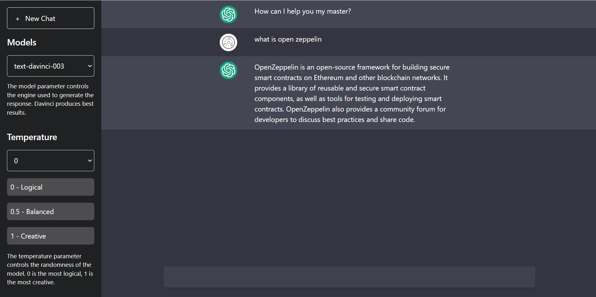

<a name="readme-top"></a>

<!-- [![MIT License][license-shield]][license-url] -->

[![LinkedIn][linkedin-shield]][linkedin-url]

<br />
<div align="center">
    

  <h3 align="center">Enhanced ChatGPT : ChatGPT 2.0 with improvements</h3>

  <p align="center">
    AI chat application powered by OpenAI
    <br />
    Forked from <a href="https://github.com/subrotokumar/enhanced-chatgpt">here</a>
    <br />
    <br />
    <a href="https://github.com/bozazec/enhanced-chatgpt-3.5-turbo/issues">Report Bug</a>
    ·
    <a href="https://github.com/bozazec/enhanced-chatgpt-3.5-turbo/issues">Request Feature</a>
  </p>
</div>

<!-- TABLE OF CONTENTS -->
<details>
  <summary>Table of Contents</summary>
  <ol>
    <li>
      <a href="#about-the-project">About The Project</a>
      <ul>
        <li><a href="#built-with">Built With</a></li>
      </ul>
    </li>
    <li>
      <a href="#getting-started">Getting Started</a>
      <ul>
        <li><a href="#prerequisites">Prerequisites</a></li>
        <li><a href="#installation">Installation</a></li>
      </ul>
    </li>
    <li><a href="#usage">Usage</a></li>
    <li><a href="#roadmap">Roadmap</a></li>
    <li><a href="#contributing">Contributing</a></li>
    <!-- <li><a href="#license">License</a></li> -->
    <li><a href="#contact">Contact</a></li>
    <li><a href="#acknowledgments">Acknowledgments</a></li>
  </ol>
</details>

<!-- ABOUT THE PROJECT -->

## About The Project

<br>
<p align='center'>
<a href='https://enhanced-chatgpt-zeta.vercel.app/'>

</a>
</p>
<br>

Chat GPT is a form of artificial intelligence (AI) technology that uses natural language processing (NLP) to simulate a conversation between a user and a computer. It is used to provide automated customer service, support, and other kinds of automated communication. Chat GPT is becoming increasingly popular as an alternative to more traditional customer service methods, such as phone calls or emails.

Keeping this point in mind, I tried creating own version of ChatGPT using OpenAI API and React.

<p align="right">(<a href="#readme-top">back to top</a>)</p>

### Built With

Frameworks/libraries used to this project:

- JavaScript
- OpenAI
- Vite
- React
- Tailwind CSS

<p align="right">(<a href="#readme-top">back to top</a>)</p>

<!-- GETTING STARTED -->

## Getting Started

To get a local copy up and running follow these simple example steps.

### Prerequisites

The list things you need to use the application and how to install them.

- Node
- Open AI apiKey

### Installation

1. Install Node JS at your system.
2. Clone the repo
   ```sh
   git clone https://github.com/subrotokumar/enhanced-chatgpt.git
   ```
3. Move to project folder

   ```sh
   ch enhanced-chatgpt
   ```

4. Install packages:

   ```sh
   yarn
   ```

   or

   ```sh
   npm install
   ```

5. Set Open AI api key and organisation key in `.env`
   ```
   VITE_API_KEY=''
   VITE_ORG=''
   ```
6. Run application locally in debug mode

   ```sh
   yarn dev
   ```

   or

   ```sh
   npx run dev
   ```

<p align="right">(<a href="#readme-top">back to top</a>)</p>

<!-- USAGE EXAMPLES -->

## Usage

ChatGPT and OpenAI is becoming increasingly popular as an alternative to more traditional customer service methods, such as phone calls or emails.

_For more info about OpenAI, please refer to the [Documentation](https://beta.openai.com/docs/introduction/overview)_

<p align="right">(<a href="#readme-top">back to top</a>)</p>

<!-- ROADMAP -->

## Roadmap

- [ ] Better chat formatting

See the [open issues](https://github.com/subrotokumar/enhanced-chatgpt/issues) for a full list of proposed features (and known issues).

<p align="right">(<a href="#readme-top">back to top</a>)</p>

<!-- CONTRIBUTING -->

## Contributing

Contributions are what make the open source community such an amazing place to learn, inspire, and create. Any contributions you make are **greatly appreciated**.

If you have a suggestion that would make this better, please fork the repo and create a pull request. You can also simply open an issue with the tag "enhancement".
Don't forget to give the project a star! Thanks again!

1. Fork the Project
2. Create your Feature Branch (`git checkout -b feature/FeatureName`)
3. Commit your Changes (`git commit -m 'Added FeatureName'`)
4. Push to the Branch (`git push origin feature/FeatureName`)
5. Open a Pull Request

<p align="right">(<a href="#readme-top">back to top</a>)</p>

<!-- LICENSE -->

[linkedin-shield]: https://img.shields.io/badge/-LinkedIn-black.svg?style=for-the-badge&logo=linkedin&colorB=555
[linkedin-url]: https://www.linkedin.com/in/bozidar-zecevic/
